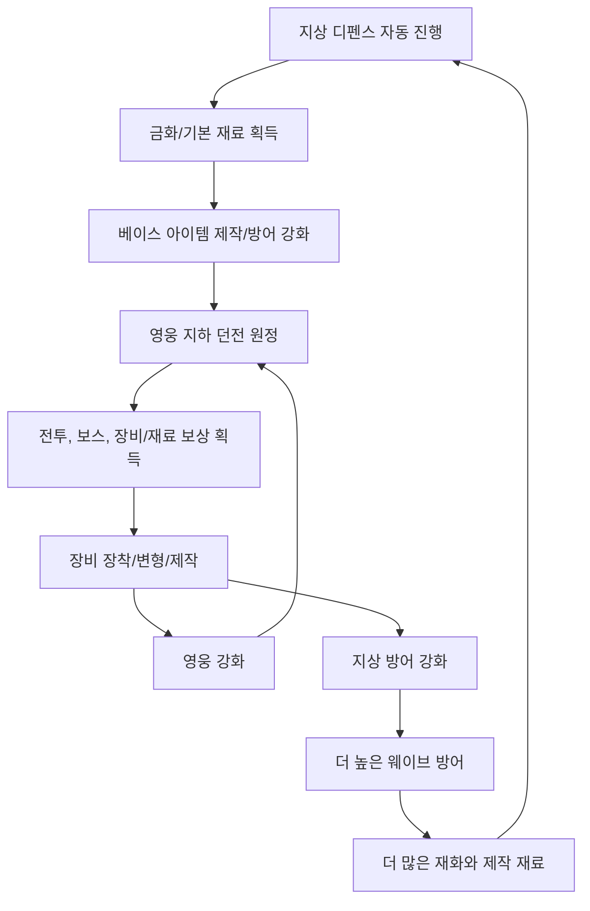
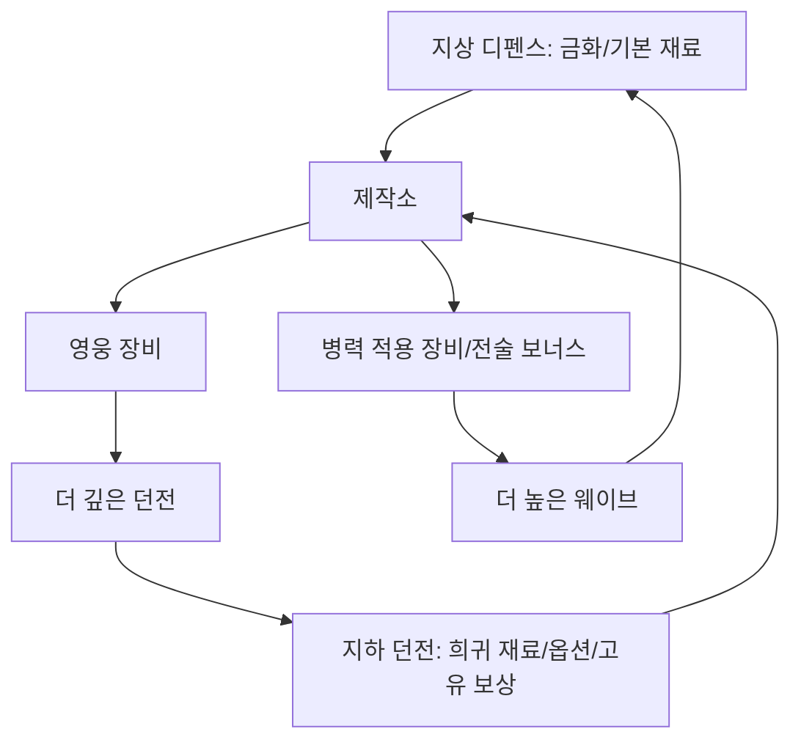

# Incremental Diablo Game Design Document

## 2026-06-09 Implementation Direction Note

- The current ground-defense fixed three-slot actor projection has completed its behavior-readability purpose. It is not the final defense design and will not receive further placeholder polish.
- Phase C is complete from accumulated accepted evidence. Do not schedule more broad loop validation unless a regression or changed contract creates a new risk.
- Phase D D0-A save-backed dungeon depth progression is implemented and accepted in Play Mode: selected depth, highest unlocked depth, clear-based one-step unlock, failure without advancement, normal HUD controls, schema-v2 migration, and save/load persistence.
- Phase D D0-B is implemented and accepted in Play Mode: selected depth scales spawned enemy health/damage, item level/rolled power, and salvage material yield, while the normal HUD exposes the active band multipliers.
- `Tools/Automation/Export-DungeonDepthBalance.ps1` exports and checks the same C# constants through `GameDesign/Balance/DungeonDepthBalance.csv`.
- Phase D D0-C is complete: the six authored tier-1 items live in a production `ItemDefinitionRegistry`, save schema v3 applies explicit item-id remaps, unknown ids are preserved as unusable quarantined records with visible diagnostics, and normal `Gameplay` cannot silently grant runtime fallback loot.
- D0-D duplicate/low-value item conversion is the immediate production target because a no-trade single-player economy needs durable value after current equipment slots are filled.
- Future ground-defense production must remain automatic and continuous-frontline based, but should move to reusable pooled prefabs, archetype data, real targeting/death, and scalable feedback rather than hand-authored waves or fixed blockout slots.

작성일: 2026-04-30  
문서 버전: v0.2  
프로젝트 상태: 초기 프로토타입 / 기획 기준서  
대상 플랫폼: PC, Steam 우선  
작업명: Incremental Diablo

## 1. 기획 의도

### 한 줄 설명

디아블로식 던전 크롤링(직접/자동)과 방치형 디펜스 성장이 결합된 PC 핵앤슬래시 증분 RPG.

### 목표

이 프로젝트는 단순한 전투 프로토타입이 아니라, 최종적으로 Steam 출시와 개인 포트폴리오/서비스 확장을 목표로 하는 완성형 게임을 지향한다. 핵심은 디아블로식 장비 파밍과 던전 탐험의 재미를 유지하면서, 방치형 게임 특유의 장기 성장감과 자동 진행의 쾌감을 결합하는 것이다.

일반적인 핵앤슬래시 RPG는 플레이어가 반복 전투를 계속 직접 수행해야 피로가 쌓인다. 반대로 일반적인 방치형/증분 게임은 시간이 지날수록 숫자가 과도하게 커지고, 전투 화면이 읽기 어려워지며, 플레이 감각이 추상적인 수치 성장으로만 수렴하기 쉽다.

이 게임은 두 장르의 역할을 분리한다.

- 지상 방치형 디펜스는 큰 숫자, 자동 전투, 재화 축적, 장기 목표를 담당한다.
- 지하 던전 크롤링은 느린 고전 RPG 감각, 읽히는 전투, 장비 파밍, 보스전 판단을 담당한다.

두 모드는 분리된 미니게임이 아니라, 재화와 장비 제작을 통해 서로를 강화하는 하나의 순환 구조로 연결된다.

## 2. 외부 설명용 요약

플레이어는 지상에서 성채 앞 방어선을 성장시키며 몰려오는 적 웨이브를 자동으로 막는다. 방어에 성공하면 금화와 기본 제작 재료가 쌓이고, 이 재화로 원하는 베이스 아이템을 제작하거나 방어 구조물과 병력을 강화한다. 영웅은 지하 던전에 원정해 디아블로식 전투와 장비 파밍을 수행하고, 던전에서 얻은 장비와 희귀 재료는 영웅 강화뿐 아니라 지상 디펜스 성장에도 쓰인다.

기본 진행은 자동화되어 있지만, 지하 던전에서 자동 전투로는 안정적으로 이기기 어려운 보스전이나 위험 구간은 플레이어가 직접 조작해 패턴 회피, 위치 선정, 스킬 사용으로 더 좋은 결과를 낼 수 있다. 직접 조작은 필수 노동이 아니라, 막힌 구간을 넘거나 효율을 높이는 선택지로 작동한다.

목표 플레이타임은 방치형 게임의 장르 특성을 고려해 길게 잡는다. Steam 1.0 기준으로 약 900시간 전후를 "충분히 게임의 끝까지 즐겼다"고 느끼는 장기 목표로 삼고, 극한 수집/최종 최적화까지 포함하면 약 1500시간까지 확장될 수 있는 구조를 지향한다. 단, 이는 손으로 만든 900시간 분량의 스테이지를 의미하지 않는다. 장기 진행, 자동화, 장비 랜덤성, 난이도 티어, 반복 가능한 원정 구조를 통해 만들어지는 플레이타임이다.

## 3. 핵심 디자인 원칙

### 3.1 던전은 읽혀야 한다

지하 던전은 이 게임의 핵심 감성이다. 방치형 게임처럼 숫자가 폭발하더라도, 던전 안에서는 전투 상황을 읽을 수 있어야 한다. 몬스터 수, 이펙트, 피해 숫자, 이동 속도, 스킬 빈도는 플레이어가 상황을 이해할 수 있는 선에서 제한한다.

던전의 재미는 다음에서 나온다.

- 장비 옵션을 보고 판단하는 재미
- 자동 전투로는 애매한 보스 패턴을 직접 조작으로 넘는 재미
- 느리지만 확실하게 깊은 층으로 내려가는 탐험감
- 좋은 베이스 아이템과 희귀 변형 재료를 발견하는 기대감

### 3.2 지상 디펜스는 재화와 장기 성장을 담당한다

지상 방치형 디펜스는 숫자가 커지는 재미, 자동 진행, 장기 목표, 재화 축적의 공간이다. 여기서는 던전보다 더 과감한 수치 상승과 자동화를 허용한다.

지상 디펜스의 재미는 다음에서 나온다.

- 오프라인/자동 진행으로 재화가 쌓이는 만족감
- 성벽, 포탑, 병력, 함정이 점점 강해지는 성장감
- 더 높은 웨이브를 막아 더 좋은 기본 재료를 얻는 목표
- 던전에서 얻은 장비와 희귀 재료가 방어 성장에도 영향을 주는 확장감

### 3.3 직접 조작은 보상이지 의무가 아니다

이 게임의 기본 성격은 장기 성장형 게임이다. 따라서 모든 콘텐츠를 직접 조작해야만 진행할 수 있으면 피로도가 높아진다.

직접 조작의 역할은 다음으로 제한한다.

- 자동 전투로는 승률이 낮은 보스전에서 패턴을 피해 승리 가능성을 높인다.
- 위험한 던전 구간에서 위치 선정과 스킬 사용으로 생존력을 높인다.
- 같은 장비 상태에서도 플레이어 숙련으로 조금 더 높은 난이도를 시도할 수 있게 한다.
- 이미 충분히 성장한 구간은 자동 전투만으로 처리된다.

즉, 직접 조작은 "필수 반복 노동"이 아니라 "막힌 곳을 뚫는 수단"이다.

### 3.4 아이템이 두 세계를 연결한다

지상 디펜스와 지하 던전은 아이템과 제작 재료를 통해 연결된다.

- 지상 디펜스는 금화, 기본 제작 재료, 베이스 아이템 준비 재화를 제공한다.
- 지하 던전은 희귀 옵션, 변형 재료, 고급 제작 재료, 보스 보상을 제공한다.
- 완성된 장비는 영웅을 강화하고, 일부 제작 결과는 지상 방어 구조물과 병력에도 영향을 준다.
- 강해진 지상 디펜스는 더 높은 웨이브 보상을 안정적으로 얻어 던전 준비와 제작을 돕는다.

이 구조 덕분에 플레이어는 한쪽 모드만 반복하는 것이 아니라, 두 모드를 오가며 성장의 이유를 만든다.

## 4. 핵심 플레이 루프

### 단계별 설명

1. 지상 방치형 디펜스가 자동으로 진행된다.
2. 플레이어는 누적된 금화와 기본 제작 재료를 확인한다.
3. 원하는 장비의 베이스 아이템을 제작하거나 선별한다.
4. 영웅이 지하 던전으로 원정한다.
5. 던전에서 자동 전투를 기본으로 진행하되, 어려운 보스전에서는 직접 조작으로 이득을 볼 수 있다.
6. 보상으로 장비, 제작 재료, 변형 재료를 얻는다.
7. 장비를 영웅에게 장착하거나, 일부 재료를 지상 방어 강화에 사용한다.
8. 강화된 방어로 더 높은 웨이브를 막는다.
9. 더 많은 재화와 제작 재료가 쌓인다.
10. 더 깊은 던전과 더 높은 웨이브로 반복된다.

## 5. 게임 모드

### 5.1 지상 방치형 디펜스

지상 디펜스는 성채 앞 방어선이 끊임없이 늘어나는 적 압박을 버티는 자동 진행 모드다. 현재 구현 기준은 수동 웨이브 목록이 아니라 `Frontline Level`과 `Hold/Push` 전환이다. 성채는 절대 안전하며, 적은 성채를 함락시키지 못한다.

역할:

- 기본 재화 생산
- 병력 성장 확인
- 장기 방치 보상 제공
- 플레이어가 접속하지 않은 동안에도 진행감을 제공
- 지하 던전 준비를 위한 금화와 기본 제작 재료 제공

주요 요소:

- 병력 배치
- 방어 시설
- 성벽/포탑/함정 강화
- 자동 전투 로그
- 오프라인 보상

지상전의 버튼 단위 플로우와 적 행동 규칙은 `GroundBattleFlowBlueprint.md`의 방어 전용 원칙과 `ProductionDocs/03_GroundDefenseSystemSpec.md`의 지속 전선 규칙을 기준으로 한다. 상위 기획서와 세부 규칙이 충돌할 경우, 최신 `ProductionDocs`의 `Frontline Level`/`Hold`/`Push` 구현 규칙을 우선한다.

디펜스는 패배해도 모든 것을 잃는 구조가 아니어야 한다. 실패는 이번 웨이브 보상 없음, 성벽/포탑 손상, 병력 부상처럼 화면에서 바로 이해되는 방식으로 처리한다. 생산건물 점령, 전선 후퇴, 생산 효율 감소 같은 규칙은 기본 구조에서 제외한다.

### 5.2 지상 디펜스 전선 단계

전선 단계는 지상 디펜스의 난이도와 보상을 올리는 단위다. 플레이어는 적진을 공격하지 않고, 성채 앞 방어선을 강화해 더 높은 `Frontline Level`까지 밀어붙인다. 단계는 손으로 작성한 웨이브 목록이 아니라 공식 기반 압박/보상 성장으로 확장한다.

역할:

- 금화와 기본 제작 재료 획득
- 방어 구조물과 병력 성장 확인
- 더 높은 Frontline Level 보상 해금
- 던전 준비 재화 확보

주요 요소:

- Frontline Level
- 적 압박
- 성벽 내구도
- 포탑 공격력
- 병력 전투력
- 수리 비용
- Hold/Push 판단
- 전선 돌파/복구

Push 중 압박을 버티면 Frontline Progress가 차고 다음 Frontline Level로 올라가며 보상이 증가한다. 버티지 못하면 성벽이 손상되고 진행이 멈춘다. 성채는 안전하므로 게임오버는 없지만, 방어를 강화하지 않으면 성장이 느려진다.

### 5.3 지하 던전 원정

지하 던전은 영웅 중심의 핵앤슬래시 모드다. 방 단위로 구성된 원정 구조를 기본으로 하며, 별도의 Unity 씬을 여러 개 만드는 방식보다 프리팹/런타임 방 조합을 우선한다.

역할:

- 핵심 장비 파밍
- 보스전
- 직접 조작의 가치 제공
- 희귀 제작 재료 획득
- 게임의 중심 감성 제공

주요 요소:

- 방 기반 진행
- 자동 전투
- 제한적 직접 조작
- 보스 패턴
- 엘리트 몬스터
- 장비 드랍
- 원정 성공/귀환/실패

던전은 지상 디펜스보다 느리고 명확해야 한다. 몬스터 한 마리, 보스 패턴 하나, 장비 옵션 하나가 플레이어에게 읽혀야 한다.

### 5.4 제작소/장비 관리

제작소는 두 모드에서 얻은 자원을 장비 성장으로 변환하는 허브다.

역할:

- 베이스 아이템 제작
- 장비 옵션 변형
- 장비 강화
- 장비 분해
- 영웅/병력 적용 방식 결정

주요 요소:

- 베이스 아이템
- 접두/접미 옵션
- 희귀 옵션
- 고정 옵션
- 변형 재료
- 실패 없는 장기 강화
- 위험한 고급 변형

제작은 너무 복잡하면 초반 진입 장벽이 높아진다. 초반에는 "장착하면 강해진다"가 명확해야 하고, 중후반부터 옵션 조합과 변형 판단이 중요해져야 한다.

## 6. 플레이어 조작 모델

### 기본 조작

기본 전투 조작은 디아블로식 클릭 이동/공격을 기준으로 한다.

- 지면 클릭: 해당 지점으로 이동
- 적 클릭: 사거리 밖이면 접근 후 1회 공격, 사거리 안이면 1회 공격
- Shift+클릭: 제자리 공격
- 스킬 키: 지정된 스킬 사용
- 회피/이동 기술: 보스 패턴 대응용

### 자동 전투

자동 전투는 기본 진행을 담당한다. 플레이어가 접속하지 않거나 직접 조작하지 않아도, 영웅은 현재 설정된 행동 규칙에 따라 던전을 진행한다.

자동 전투의 기본 규칙:

- 가까운 적 우선 공격
- 위험 지역 회피는 제한적으로 수행
- 체력 조건에 따른 물약/회복 사용
- 보스 패턴에 대한 완벽 대응은 불가능
- 장비와 성장 수치가 충분하면 안정적으로 클리어

### 직접 조작의 이득

직접 조작은 다음 상황에서 의미를 가진다.

- 보스 장판, 돌진, 투사체 회피
- 자동 전투로는 맞기 쉬운 패턴 대응
- 위험한 적 우선 처치
- 짧은 시간 동안 높은 효율의 스킬 운용
- 장비가 부족한 상태에서 한 단계 높은 던전 도전

직접 조작의 보상은 "안 하면 진행 불가"가 아니라 "하면 더 빨리, 더 일찍, 더 안정적으로 가능"해야 한다.

## 7. 성장 구조

### 성장 축

| 성장 축 | 설명 | 주 사용처 |
| --- | --- | --- |
| 영웅 레벨 | 던전 전투의 기본 성장 | 지하 던전 |
| 장비 | 핵심 전투력과 옵션 빌드 | 지하 던전 / 지상 병력 |
| 병력 성장 | 지상 디펜스 성능 | 지상 디펜스 |
| 시설 성장 | 성벽, 포탑, 함정, 자동화 | 지상 디펜스 |
| 월드 티어 | 상위 난이도와 보상 해금 | 전체 |
| 제작 숙련 | 장비 제작/변형 선택지 확장 | 제작소 |
| 자동화 해금 | 반복 조작 감소 | 장기 진행 |

### 수치 설계 방향

지상 디펜스와 지하 던전의 수치 체감은 다르게 설계한다.

지상 디펜스:

- 큰 숫자 허용
- 장기 성장 곡선 허용
- 대량 적/병력 표현 가능
- 누적 생산량과 초당 생산량 중심
- 방치형 게임 특유의 폭발적인 성장감 제공

지하 던전:

- 숫자 가독성 유지
- 적 수와 이펙트 제한
- 장비 선택과 생존 판단이 보이도록 설계
- 지나친 공격 속도/피해 숫자 난사를 제한
- 티어 상승은 하되 전투 화면은 읽을 수 있게 유지

## 8. 아이템/제작 설계

### 아이템의 역할

아이템은 게임의 중심 보상이다. 플레이어가 방치형 디펜스를 진행하는 이유도, 던전에 들어가는 이유도, 더 높은 난이도를 여는 이유도 결국 더 좋은 장비를 얻고 완성하기 위함이다.

### 아이템 흐름

### 장비 구성 예시

| 요소 | 설명 |
| --- | --- |
| 장비 부위 | 무기, 보조장비, 머리, 갑옷, 장갑, 신발, 목걸이, 반지 등 |
| 베이스 아이템 | 기본 공격력/방어력/속도/특성의 틀 |
| 등급 | 일반, 마법, 희귀, 영웅, 전설, 고유 등 |
| 옵션 | 공격력, 방어력, 체력, 쿨다운, 속성 피해, 병력 보너스 등 |
| 변형 | 옵션 재굴림, 접두/접미 변경, 등급 상승, 특수 효과 부여 |
| 귀속 방향 | 영웅 개인 장비 또는 지상 방어 보너스 장비 |

### 베이스 아이템 획득

사용자가 원하는 베이스 아이템을 어느 정도 목표로 얻을 수 있어야 한다. 완전 랜덤 드랍만 있으면 장기 게임에서 피로도가 커진다.

베이스 획득 방식:

- 지상 생산 시설에서 특정 계열 베이스 제작
- 웨이브 단계에 따라 상위 베이스 제작 재료 해금
- 던전 보스가 특정 계열 베이스를 높은 확률로 드랍
- 불필요한 베이스를 분해해 목표 베이스 제작 재료로 전환

### 제작 철학

제작은 장기 목표를 만들되, 플레이어의 시간을 무의미하게 태우면 안 된다.

- 초반: 단순 강화와 장착 위주
- 중반: 옵션 선별과 베이스 선택
- 후반: 변형, 고정 옵션, 빌드 조합
- 최종: 희귀 옵션 완성, 병력/영웅 동시 최적화

장기 게임이므로 완벽한 장비를 만드는 길은 길어도 된다. 하지만 매 플레이 세션마다 "조금 나아졌다"는 감각이 있어야 한다.

## 9. 콘텐츠 분량 목표

### 플레이타임 목표

| 구간 | 목표 체감 |
| --- | --- |
| 첫 30분 | 전투, 장비, 지상 디펜스의 관계를 이해 |
| 2-5시간 | 첫 번째 반복 루프 완성 |
| 10-30시간 | 자동화와 제작의 재미가 열림 |
| 50-150시간 | 중반 티어, 장비 빌드, 웨이브 방어 반복 |
| 150-500시간 | 장기 방치 성장, 상위 던전, 고급 제작 |
| 약 900시간 | 충분히 게임의 끝까지 즐겼다고 느끼는 지점 |
| 약 1500시간 | 극한 수집/최종 최적화/완전 완료 목표 |

이 목표는 방치형 게임의 특성을 전제로 한다. 플레이어가 900시간 동안 계속 직접 조작해야 하는 게임이 아니다. 오프라인 보상, 자동 진행, 장기 제작, 반복 가능한 난이도 구조를 포함한 총 플레이 기간에 가깝다.

### 콘텐츠 제작 원칙

900시간급 장기 플레이를 위해 모든 스테이지와 몬스터를 수작업으로 만드는 것은 현실적이지 않다. 따라서 콘텐츠는 다음 방식으로 확장한다.

- 소수의 고품질 규칙을 여러 티어에 재사용
- 몬스터 계열별 변형
- 보스 패턴 조합
- 던전 방 프리팹 조합
- 장비 옵션 랜덤성과 제작 목표
- 웨이브 단계와 월드 티어
- 반복 가능한 주간/일일 도전 구조

### Steam 1.0 목표 콘텐츠 초안

| 항목 | 1.0 목표 초안 | 비고 |
| --- | --- | --- |
| 지상 디펜스 티어 | 6-8개 월드 티어 | 각 티어는 여러 웨이브 밴드 포함 |
| 던전 테마 | 4-6개 | 에셋 확보 상황에 따라 조정 |
| 던전 깊이/단계 | 80-120개 구간 | 수작업 층이 아니라 난이도 밴드 |
| 적 계열 | 8-12개 | 색/스탯/패턴 변형으로 확장 |
| 보스 원형 | 10-16개 | 패턴 조합으로 재사용 |
| 장비 부위 | 8-10개 | ARPG 기본 슬롯 |
| 주요 베이스 계열 | 40-80개 | 티어별 상위형 포함 가능 |
| 전설/고유 효과 | 40-100개 | 빌드 다양성의 핵심 |
| 제작 재료 | 15-30종 | 너무 많은 재료는 피로도 유발 |
| 자동화 해금 | 30-60개 | 장기 편의성과 성장 목표 |
| 장기 업적/목표 | 80-150개 | Steam 업적과 내부 목표 분리 가능 |

위 수치는 확정이 아니라 제작 방향을 잡기 위한 기준이다. 실제 개발에서는 먼저 작은 수직 조각을 완성하고, 재미가 확인된 시스템만 확장한다.

### MVP 목표 콘텐츠

첫 번째 완성 가능한 목표는 900시간 분량이 아니라, 핵심 루프 하나가 작동하는 작은 버전이다.

MVP 범위:

- 지상 디펜스 화면 1개
- 방치형 재화 2-3종
- 병력 2-3종
- 던전 테마 1개
- 방 프리팹 5-8개
- 일반 적 3종
- 엘리트 적 1종
- 보스 1종
- 장비 부위 3-4개
- 베이스 아이템 10-15개
- 제작/강화 기능 1차 버전
- 자동 전투와 제한적 직접 조작
- 특정 웨이브 방어 후 상위 난이도 1단계 해금

MVP의 성공 기준:

- 플레이어가 지상에서 재화를 얻는다.
- 그 재화로 장비 준비를 한다.
- 던전에 들어가 보상을 얻는다.
- 보상으로 영웅과 지상 디펜스가 강해진다.
- 더 높은 난이도에 도전할 이유가 생긴다.

## 10. 난이도와 실패 설계

### 실패의 역할

실패는 플레이어에게 다음 목표를 알려주는 신호여야 한다. 장기 투자물을 잃게 만드는 처벌은 피한다.

권장 실패 방식:

- 던전 원정 실패 시 일부 보상만 획득
- 장비 내구도 손상 또는 수리 비용 발생
- 지상 방어 실패 시 이번 웨이브 보상 없음
- 성벽/포탑 손상
- 병력 부상 및 수리/회복 필요
- 보스 재도전 필요

피해야 할 방식:

- 핵심 장비 영구 삭제
- 장시간 성장분 완전 초기화
- 실패 원인을 알 수 없는 즉사
- 자동 전투 중 이해 불가능한 손실

### 보스전

보스전은 직접 조작의 가치가 가장 잘 드러나는 콘텐츠다.

보스 설계 원칙:

- 패턴은 시각적으로 읽혀야 한다.
- 자동 전투는 일부 패턴을 맞을 수 있다.
- 직접 조작은 회피와 위치 선정으로 손실을 줄인다.
- 장비가 충분하면 자동으로도 이길 수 있다.
- 장비가 부족하면 직접 조작으로 한 단계 높은 던전을 일찍 클리어할 수 있다.

## 11. 서비스/네트워크 방향

현재 게임의 핵심 재미는 오프라인 싱글 플레이 구조로도 성립한다. 따라서 네트워크 기능은 필수가 아니라, 포트폴리오와 개인 서비스 경험을 위한 선택적 확장으로 설계한다.

### 추천 방향

초기에는 오프라인 우선으로 개발한다. 이후 서버 기능은 게임의 핵심 루프를 망치지 않는 비동기 기능부터 추가한다.

권장 순서:

1. 로컬 세이브
2. 선택적 클라우드 세이브
3. 계정/프로필
4. 주간 도전 던전
5. 비동기 랭킹
6. 빌드 공유/장비 공유
7. 간단한 통계 대시보드

### 이 게임에 어울리는 네트워크 기능

| 기능 | 적합도 | 이유 |
| --- | --- | --- |
| 클라우드 세이브 | 높음 | 장기 플레이 게임에서 가치가 큼 |
| 주간 도전 던전 | 높음 | 동일 조건에서 빌드/조작 비교 가능 |
| 비동기 랭킹 | 높음 | 실시간 멀티 없이 서비스 경험 가능 |
| 플레이어 프로필 | 중간 | 장비/웨이브 진행도 공유 가능 |
| 빌드 공유 | 중간 | 장비 조합 게임과 잘 맞음 |
| 실시간 협동 | 낮음 | 개발 부담이 크고 핵심 루프와 직접 관련이 약함 |
| 거래소 | 낮음 | 밸런스와 운영 부담이 매우 큼 |

### 개인 서비스 포트폴리오 관점

네트워크를 넣는다면 다음 경험을 보여줄 수 있다.

- 계정 인증
- 세이브 업로드/다운로드
- 서버 API
- 랭킹 집계
- 주간 도전 데이터 배포
- 간단한 운영툴 또는 통계 페이지

다만 1차 출시 목표에서는 네트워크가 없어도 게임이 완성되어야 한다. 서버가 없으면 게임이 성립하지 않는 구조는 피한다.

## 12. 비주얼/톤

### 톤

에셋 확보 상황을 고려해 전체 톤은 너무 무겁고 사실적인 다크 판타지보다, 약간 가벼운 판타지 핵앤슬래시 방향을 우선한다. 스토리 몰입보다 성장감, 장비 파밍, 반복 루프의 명확함이 중요하다.

### 스토리 비중

스토리는 최소한의 세계 설명과 진행 명분만 제공한다.

스토리의 역할:

- 왜 지상 성채를 방어하는지 설명
- 왜 지하 던전에 내려가는지 설명
- 월드 티어 상승의 명분 제공
- 보스와 지역에 간단한 개성 부여

스토리가 핵심 플레이를 막거나 대량 텍스트를 요구하지 않도록 한다.

### 에셋 전략

현재 개발자가 직접 고품질 에셋을 제작하기 어렵기 때문에, 에셋 전략은 유연해야 한다.

가능한 방식:

- 보유 에셋 우선 사용
- Asset Store 등 외부 에셋 활용
- AI 생성 이미지/텍스처/아이콘 보조 활용
- 프로토타입 단계에서는 임시 에셋 허용
- 최종 출시 전에는 스타일 불일치 정리

중요한 것은 처음부터 완벽한 아트를 기다리지 않는 것이다. 핵심 루프를 먼저 만들고, 반복 플레이가 재미있는지 확인한 뒤 아트 방향을 좁힌다.

## 13. 기술/구현 방향

### 현재 프로젝트 기준

현재 Unity 프로젝트는 `Assets/02.Scripts` 아래에 캐릭터, 던전, 아이템, 공유 코드 영역을 두는 방향으로 정리되어 있다. 캐릭터는 상속보다 컴포넌트 조합을 우선하며, `CharacterActor`가 몸체이자 허브 역할을 한다.

현재 방향:

- `CharacterActor`: 캐릭터 허브
- `CharacterMotor`: 이동 실행
- `CombatDriver`: 공격 실행
- `Health`: 현재 체력 상태
- `CharacterStats`: 계산된 스탯
- `PlayerController`: 플레이어 입력
- 향후 `AutoCombatController`, `EnemyAIController` 추가 가능

이 구조는 직접 조작 영웅, 자동 전투 영웅, 적 캐릭터를 같은 기반 위에서 다루기 좋다.

### 데이터 설계 방향

장기 콘텐츠를 다루려면 데이터 중심 구조가 필요하다.

권장 데이터:

- 아이템 정의
- 장비 옵션 정의
- 몬스터 정의
- 보스 패턴 정의
- 던전 방 정의
- 웨이브 티어 정의
- 병력 정의
- 시설/업그레이드 정의
- 제작 레시피

Unity에서는 초기에 ScriptableObject 기반으로 시작하고, 필요하면 CSV/JSON 임포트 파이프라인을 추가한다.

### 저장/오프라인 진행

방치형 게임이므로 저장과 오프라인 진행은 핵심 시스템이다.

필요 기능:

- 로컬 저장
- 마지막 접속 시간 기록
- 오프라인 보상 계산
- 장시간 미접속 보상 제한
- 치트/시간 조작 대응 여부 검토
- 저장 데이터 버전 관리

오프라인 보상은 너무 후하면 접속 플레이의 의미가 줄고, 너무 약하면 방치형 장르의 기대를 충족하지 못한다. 초반에는 간단히 구현하되, 밸런스 테스트를 통해 조정한다.

## 14. 출시 방향

### 기본 출시 형태

현재 목표는 Steam용 PC 게임이다. 사업적 투자/퍼블리싱/마케팅은 당장 핵심 목표가 아니며, 먼저 완성 가능한 게임을 만드는 것이 우선이다.

추천 출시 방향:

- 오프라인 싱글 플레이 우선
- 유료 패키지 또는 저가 Early Access 가능성 검토
- 업데이트 가능한 구조
- 네트워크 기능은 선택적 확장
- 과금형 라이브서비스는 초기 목표에서 제외

### 업데이트 방향

업데이트가 가능하다면 다음 순서가 적합하다.

1. 신규 던전 테마
2. 신규 보스
3. 신규 장비 옵션/고유 아이템
4. 신규 웨이브 티어
5. 신규 자동화 기능
6. 주간 도전/랭킹 같은 선택적 서비스 기능

업데이트는 완전히 새로운 시스템을 계속 추가하기보다, 기존 루프를 더 깊게 만드는 쪽이 안정적이다.

## 15. 개발 마일스톤

현재 2026년 5월은 Unreal Engine 학습/작업에 집중하고, 그 이후부터 이 프로젝트를 본격화하는 일정으로 가정한다. 정확한 출시일은 아직 정하지 않는다.

### Milestone 0: 기획 고정 및 프로토타입 정리

목표:

- 핵심 루프 문서화
- 조작 모델 정리
- 코드 폴더 구조 유지
- 현재 프로토타입의 기준점 저장

완료 기준:

- 이 문서 기준으로 설명 가능
- 다음 구현 순서가 명확함
- 던전/아이템/지상 디펜스의 관계가 흔들리지 않음

### Milestone 1: 핵심 루프 MVP

목표:

- 지상 자동 진행
- 재화 획득
- 베이스 아이템 준비
- 지하 원정
- 던전 보상 획득
- 장비 장착/강화
- 지상 디펜스 강화
- 상위 난이도 1단계 해금

완료 기준:

- 플레이어가 30-60분 동안 하나의 완전한 반복을 경험할 수 있음
- 자동 진행과 직접 조작의 역할이 구분됨
- 임시 에셋이어도 플레이 흐름이 이해됨

### Milestone 2: 수직 조각

목표:

- 던전 테마 1개 완성
- 보스 2-3종
- 장비 옵션 체계 1차 완성
- 제작/변형 1차 완성
- 지상 디펜스 기본 구조 완성
- 오프라인 보상 구현

완료 기준:

- 5-10시간 이상 테스트 가능한 진행 구조
- "더 좋은 장비를 만들고 싶다"는 동기가 생김
- 자동화와 직접 조작의 균형을 테스트할 수 있음

### 2026-05-22 현재 진행 판정

현재 프로젝트는 완성판에 가까운 상태가 아니라, 첫 실제 게임 조각이 형체를 갖추는 단계다. `Milestone 1: 핵심 루프 MVP`의 주요 연결부는 코드와 HUD/저장/보상 기준으로 상당 부분 증명됐고, 이제 `Milestone 2: 수직 조각`으로 넘어가기 위해 플레이어가 직접 보는 전투 장면을 채워야 한다.

2-4개월 안에 "게임 형태"를 만든다는 목표 기준으로는 방향과 속도가 아직 적절하다. 단, 이것은 Steam 1.0 완성을 의미하지 않는다. 현재 속도가 계속 유효하려면 다음 작업들이 문서/마커/진단 보조보다 우선되어야 한다.

- 지상 디펜스에서 적 또는 압박 오브젝트가 실제로 전진한다.
- 성벽 접촉, 피해, 수리, 방어 성공/실패가 장면에서 읽힌다.
- 포탑/병력/방어 수단이 자동으로 공격한다.
- 던전 방에서 실제 적 프리팹 처치와 authored item 보상이 자연스럽게 이어진다.
- 장비/인벤토리/제작이 플레이어용 UI에서 확인된다.

판정: 프로젝트는 정상 궤도지만, 다음 단계의 성공 기준은 더 많은 테스트 장치가 아니라 "실제로 싸우는 지상 디펜스와 직접 조작 던전"이다.

### Milestone 3: 장기 성장 테스트

목표:

- 여러 월드 티어
- 반복 가능한 던전 난이도
- 장비 파밍 목표
- 지상 웨이브 방어 반복
- 저장/오프라인 진행 안정화

완료 기준:

- 며칠 이상 켜두거나 반복 접속해도 성장 구조가 유지됨
- 숫자 상승이 너무 빠르거나 너무 답답하지 않은지 판단 가능
- 장비/재화 병목이 보임

### Milestone 4: Steam 공개 후보

목표:

- Steam 페이지에 보여줄 수 있는 플레이 영상 확보
- 핵심 UI 정리
- 튜토리얼/초반 흐름 정리
- 최소 콘텐츠 볼륨 확보
- 빌드 안정화

완료 기준:

- 외부인이 게임 목적과 루프를 이해할 수 있음
- 저장/로드/오프라인 보상이 안정적으로 동작
- 첫 30분 경험이 정리됨

## 16. 주요 리스크와 대응

| 리스크 | 설명 | 대응 |
| --- | --- | --- |
| 900시간 목표 과확장 | 장기 플레이를 수작업 콘텐츠로 오해하면 개발 불가능 | 반복 가능한 시스템과 티어 구조로 해결 |
| 장르 충돌 | 방치형 숫자 폭발이 던전 가독성을 해칠 수 있음 | 지상/지하 수치 표현과 전투 밀도 분리 |
| 아이템 시스템 과복잡화 | 초반부터 제작이 복잡하면 진입 장벽 증가 | 초반 단순, 후반 심화 구조 |
| 네트워크 범위 증가 | 서버 기능이 핵심 개발을 잡아먹을 수 있음 | 오프라인 우선, 비동기 기능만 단계적 추가 |
| 에셋 스타일 불일치 | 구매/AI/임시 에셋 혼용으로 분위기 흔들림 | 출시 전 핵심 화면부터 스타일 정리 |
| 밸런스 테스트 부족 | 방치형 경제는 작은 수치 차이가 큰 문제로 커짐 | 로그/시뮬레이션/테스트 세이브 활용 |
| 직접 조작 강제감 | 보스전이 너무 어려우면 방치형 유저에게 부담 | 직접 조작은 효율 보너스, 충분한 성장 후 자동 가능 |

## 17. 다음 결정 사항

아직 확정되지 않은 항목:

- 최종 게임 제목
- 첫 번째 던전 테마
- 첫 번째 지상 디펜스 테마
- 영웅 직업 수
- 장비 부위 수
- 스킬 시스템 깊이
- 네트워크 기능의 실제 포함 여부
- Steam 출시 형태: 정식 출시 또는 Early Access
- 목표 가격대
- 최종 아트 스타일

우선순위가 높은 다음 결정:

1. 첫 MVP에 들어갈 지상 디펜스 1개와 던전 1개의 테마를 정한다.
2. 장비 부위와 베이스 아이템의 최소 범위를 정한다.
3. 자동 전투가 어느 정도까지 똑똑해야 하는지 정한다.
4. 보스전에서 직접 조작으로 얻는 이득의 크기를 정한다.
5. 오프라인 보상 계산 방식을 정한다.

## 18. 현재 결론

이 프로젝트의 핵심은 "디아블로를 자동사냥으로 만든다"에서 끝나지 않는다. 더 정확히는, 디아블로식 장비 파밍과 던전 전투를 방치형 장기 성장 구조 안에 넣되, 던전의 가독성과 느린 탐험감을 끝까지 보존하는 게임이다.

지상 디펜스는 방치형 게임다운 규모와 성장 쾌감을 담당한다. 지하 던전은 플레이어가 장비를 보고, 보스를 읽고, 한 단계 더 깊이 내려가는 감각을 담당한다. 아이템은 두 세계를 연결하는 핵심 매개체다.

따라서 앞으로의 개발은 다음 순서를 따라야 한다.

1. 지상 자동 진행을 만든다.
2. 베이스 아이템 획득/제작을 만든다.
3. 지하 던전 원정을 만든다.
4. 던전 보상이 영웅과 병력을 모두 강화하게 만든다.
5. 강화된 방어로 상위 웨이브를 막게 만든다.
6. 이 순환이 재미있을 때만 콘텐츠 양을 늘린다.

이 루프가 작동하면, 이후 900시간급 장기 플레이 목표는 손으로 만든 거대한 스토리 분량이 아니라, 성장 곡선, 아이템 목표, 자동화, 티어 확장, 반복 가능한 던전 구조를 통해 확장할 수 있다.
