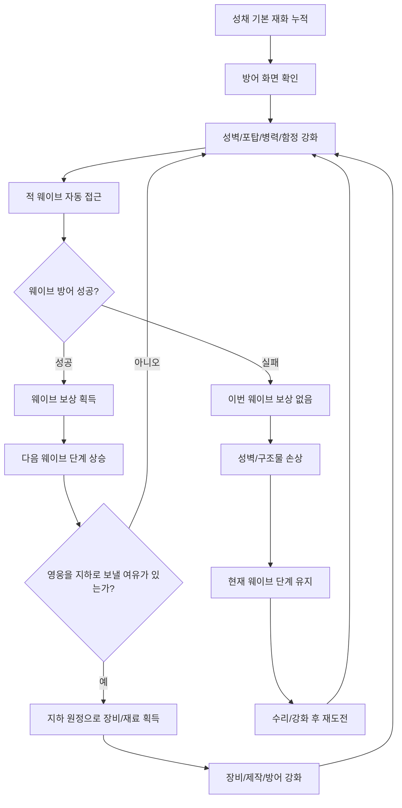
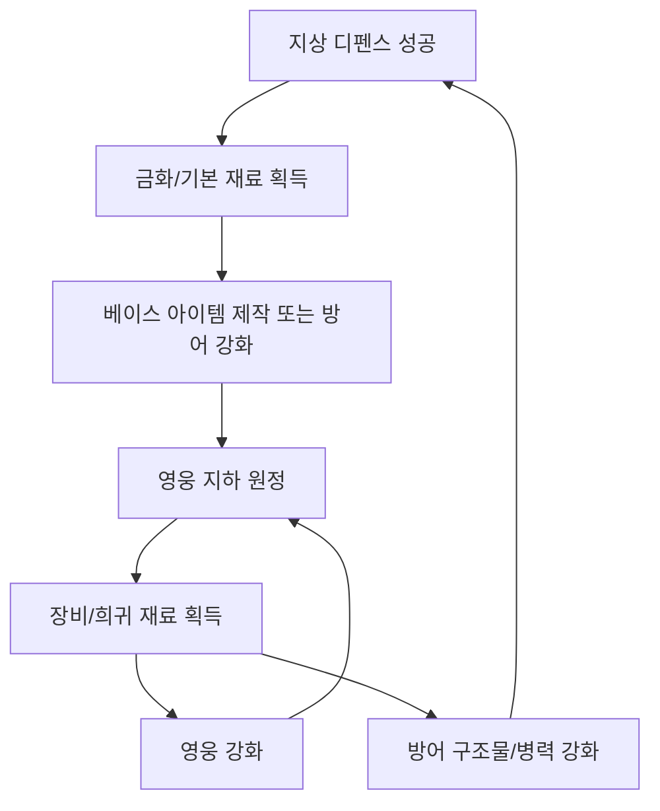

# Ground Defense Flow Blueprint

## 2026-06-17 E0-A3 Formula-Driven Scale Flow

```text
Frontline profile changes
-> visual force profile derives count, role tier, and respawn cadence
-> default band keeps the accepted low-density battle
-> higher bands add bounded enemies and role variety
-> autonomous units still acquire, move, stop, attack, react, die, reinforce, or attack wall
-> every visible hit must still read as Unit -> action -> target
```

This flow adds spectacle through formulas, not authored wave rows or player unit commands. The accepted E0-A2 ownership markers and attack lines remain the proof mechanism. E0-A3 needs Play Mode acceptance before it can be marked done.

## 2026-06-16 E0-A2 Readable Ownership Flow

```text
Enemy spawns on hostile side
-> enemy cutout sprite, red base, and threat badge identify its faction
-> defender cutout sprite, blue base, and shield badge identify its faction
-> NavMesh movement brings attacker and target into range
-> attacker stops and faces target
-> short attacker-to-target line appears during the hit
-> target flashes/recoils, then recovers or dies
-> surviving enemy reaches the wall and the hit line points to the wall
-> authoritative wall health drops
```

This flow preserves the 2026-06-15 accepted movement, targeting, death/reinforcement, and wall-damage behavior. User Play Mode feedback accepted it on 2026-06-17. E0-A3 can now add formula-driven role mix and density, but added spectacle must keep the low-density `attacker -> action -> target` read intact.

## 2026-06-15 Actual NavMesh Battle Flow

```text
Enemy spawns on hostile side
-> NavMeshAgent runs across visible ground
-> nearest living defender intercepts
-> both use shared stats/health/basic attacks
-> defeated unit dies and later reinforces
-> surviving enemy reaches the wall
-> enemy attack cadence damages authoritative wall health
```

`GroundDefenseNavMeshBattlefield` is now the normal `Gameplay` path. The previous zone/static-grammar/pooled-presentation path is disabled because it explained telemetry rather than producing an understandable battle. Later work may add tower/ranged attacks and formula-driven force density, but it must preserve this direct actor-to-target flow.

The user accepted this runtime flow in Play Mode on 2026-06-15. Do not reopen movement, targeting, reinforcement, or wall-damage validation unless those contracts change. The 2026-06-16 section above is the accepted visual ownership proof.

## 2026-06-15 Static Noun Rendering Repair

The historical static flow remained paused before combat. Enemy, defender, tower, and wall used runtime sprite cells instead of generated UV/material role quads. The accepted actual NavMesh battlefield superseded this route, so it is no longer the active validation path.

## 2026-06-14 Static Grammar Gate

The visible ground flow is temporarily held before combat:

```text
Enemy staging zone -> one hostile unit -> approach ground -> contact line
-> one friendly defender -> fixed tower -> protected wall
```

`DefenseRuntimeState` continued to advance resources, pressure, Hold/Push, wall state, and progression, but pooled actor motion and attacks were hidden. User validation confirmed the spatial bands but rejected the initial quad-rendered nouns. The accepted actual NavMesh battlefield superseded this paused-frame proof.

## 2026-06-13 Failed Readability Check And Required Battle Grammar

- The first runtime battlefield pass failed because enemies read as rapidly spawned objects moving top-to-bottom rather than units crossing a battlefield toward a defended line.
- The wall-side projectile had no readable source, target, or impact ownership.
- The next flow proof must use one enemy, one defender, one tower, and one wall:

```text
Enemy staging
-> enemy approaches across ground
-> enemy stops at contact line
-> defender winds up and strikes
-> enemy reacts
-> tower aims and launches from visible muzzle
-> projectile travels to that enemy
-> impact/death or enemy continues to wall
-> wall receives visible enemy-owned damage
```

- Static object roles must be understandable before this flow starts. Do not use motion, health bars, or diagnostic text to compensate for unclear unit/building silhouettes.
- Do not restore rapid spawn cadence, multiple formations, or reinforcement spectacle until one complete exchange is readable in the compressed panel.

## 2026-06-13 Runtime Battlefield Bridge

- Pooled enemies now approach through multiple visual lanes and converge on one defender contact line before reaching the wall.
- Real actor-hit events drive defender melee lunges or tower projectiles; the attack presentation no longer loops independently from combat telemetry.
- Enemy deaths recycle pooled views. Wall pressure can visibly remove one defender and bring a reinforcement from the protected side.
- Wall health, hit, and breach feedback is rendered on the wall itself. Moving markers, repeating attack pulses, and the detached wall flash are disabled in the normal scene.
- This remains automatic visualization of the continuous frontline. It adds no player unit commands, wave rows, or saved actor roster.

## 2026-06-12 Approved RTS-Readable Automatic Defense

- The ground layer uses classic RTS battle staging for spectacle and clarity: enemy groups advance from the far side, defender squads intercept them before the wall, ranged units and fixed towers launch visible projectiles, defeated units fall or disappear through a death action, and reinforcements enter from their faction side.
- Use `GameDesign/References/2026-05-17_FinalGameplayScreenConcept.png` for battlefield composition and camera/read hierarchy. Use `Assets/06.Art/Sprites/GroundDefense/GroundDefense_ReadabilitySheet.png` for the current unit/structure silhouettes and dark-fantasy role language.
- The prepared art should become units and structures inside one battlefield. Do not present each image as an isolated card, marker, or floating icon.
- Remove generic `pulse` presentation from the production target. Attack readability comes from an attacker animation plus a projectile or melee contact; damage readability comes from hit reaction, health change, death, and structure damage attached to the affected object.
- This is not individual-unit RTS control. The player does not select, move, focus-fire, or queue individual soldiers. Towers use fixed authored positions rather than free placement. The player makes high-level incremental decisions: wall, tower, squad, trap, formation/composition, repair, and Hold/Push upgrades.
- `DefenseRuntimeState` and `GroundDefenseBalanceModel` remain the authoritative continuous frontline and long-horizon scaling model. Visible units may be pooled and formula-selected, but must not require hand-authored wave lists.
- Existing pooled archetype/runtime work may be reused for data, health, travel, defeat, contact, and pooling. Existing billboard-only wall/defender/tower presentation, attack pulses/bolts, unattached wall flash, and player-facing diagnostic combat text are replacement targets.

작성일: 2026-04-30  
문서 버전: v0.2  
대상 문서: 지상 디펜스 플레이 플로우 / 버튼 동작 / 적 행동 규칙  
작업명: Incremental Diablo

> 현재 구현 기준: 이 문서는 초기 지상 디펜스 청사진이다. 최신 구현은 `GameDesign/ProductionDocs/03_GroundDefenseSystemSpec.md`의 지속 전선, Frontline Level, Hold/Push 규칙을 따른다. 아래의 "웨이브" 표현은 수동 웨이브 목록을 만들라는 뜻이 아니라, 플레이어가 이해하는 압박 구간/전선 단계의 옛 표현으로만 남긴다.

## 1. 이번 버전의 결론

지상전은 더 이상 생산건물 점령, 진군, 돌파, 전선 소유권 공방을 다루지 않는다. 그 구조는 전략 게임에 가까워지고, 구현과 밸런싱도 복잡해진다.

지상전은 다음처럼 단순화한다.

```text
성채는 절대 안전하다.
적은 성채 앞 방어선으로 몰려온다.
플레이어는 방어 구조물과 병력을 강화해서 막는다.
막으면 돈과 재료가 쌓인다.
못 막으면 이번 웨이브 보상을 잃고 방어선이 손상된다.
```

핵심 정체성:

```text
Zero Stress King식 저스트 디펜스 + 방치형 재화 축적
```

지상 디펜스는 던전 크롤링을 위한 발판이다. 지상에서 돈과 기본 재료를 모으고, 그 재화로 장비 베이스, 병력, 방어 구조물을 준비한다. 게임의 핵심 탐험과 아이템 파밍은 지하 던전이 담당한다.

## 2. 제거한 요소

이번 버전에서 제거한 요소:

| 제거 요소 | 제거 이유 |
| --- | --- |
| 생산건물 점령 | 지상전이 전략 게임처럼 복잡해짐 |
| 진군/출정 | 삼국지식 명령 UI처럼 느껴짐 |
| 돌파 | 던전 중심 게임에서 지상 오펜스 비중이 커짐 |
| 전선 후퇴 | 1단계 처리와 소유권 규칙이 복잡해짐 |
| 생산 효율 감소 | 눈에 잘 보이지 않고 밸런싱이 귀찮음 |
| 유닛 위치 배치 | 타워디펜스 레벨디자인 부담 증가 |
| 영웅 지상 개입 | 아직 규칙이 꼬이므로 MVP에서 보류 |

지상전은 "막기만 한다"로 고정한다.

## 3. 화면 구조

지상 디펜스는 2D 횡스크롤 또는 2D 라인 화면으로 표현한다.

```text
적 등장 지점                                      안전 성채
    ↓                                                ↓
오른쪽 ------------------------------------------------ 왼쪽

[적 웨이브] ---> ---> ---> [방어선 / 성벽 / 포탑 / 병력] | [성채]
```

성채는 절대 함락되지 않는다. 성채 앞에는 용암, 결계, 해자, 신성지대 같은 절대 방어 장치가 있다. 적이 방어선을 뚫어도 성채가 파괴되지는 않는다.

적이 방어선을 뚫으면:

```text
적이 성채 내부로 들어오는 것이 아니라,
절대 방어 장치에 소멸하면서 피해와 손실만 남긴다.
```

즉 게임오버는 없다. 대신 못 막으면 보상을 잃고 수리 비용이 생긴다.

## 4. 플레이어가 누르는 것

플레이어가 실제로 누르는 버튼은 적어야 한다.

| 버튼 | 기능 |
| --- | --- |
| 방어 시작 / 자동 진행 | 웨이브 진행을 시작하거나 자동 반복 |
| 성벽 강화 | 방어선 체력 증가 |
| 포탑 강화 | 자동 공격력 증가 |
| 병력 훈련 | 성벽 앞에서 싸우는 병력 강화 |
| 함정 강화 | 적 진입 전 피해 또는 둔화 |
| 수리 | 손상된 성벽/구조물 복구 |
| 보상 수령 | 누적된 방어 보상 획득 |
| 지하 원정 | 영웅을 던전에 보냄 |

플레이어가 하지 않는 것:

```text
유닛 이동 명령
생산건물 선택
점령 명령
출정 명령
포탑 위치 퍼즐
여러 전선 동시 관리
```

## 5. 기본 플레이 루프



## 6. 웨이브 진행

웨이브는 지상 디펜스의 진행 단위다.

### 웨이브 시작

웨이브는 자동으로 반복되거나, 플레이어가 `방어 시작`을 눌러 시작한다.

MVP에서는 자동 반복을 기본으로 한다.

```text
웨이브 1 클리어
→ 5초 대기
→ 웨이브 2 자동 시작
```

플레이어가 자동 진행을 꺼두면:

```text
현재 웨이브 클리어 후 대기
→ 플레이어가 수리/강화
→ 다시 방어 시작
```

### 웨이브 성공

성공 조건:

```text
모든 적을 성벽 앞에서 처치한다.
```

성공 결과:

- 금화 획득
- 기본 제작 재료 획득
- 병력 경험치 또는 방어 숙련도 획득
- 다음 웨이브 단계로 상승
- 일정 단계마다 새 적 또는 새 보상 해금

### 웨이브 실패

실패 조건:

```text
적이 방어선을 뚫고 성채 앞 절대 방어 장치까지 도달한다.
```

실패 결과:

- 이번 웨이브 보상 없음
- 웨이브 단계 상승 없음
- 성벽 내구도 감소
- 일부 포탑/함정 손상
- 병력 부상
- 수리 또는 강화 후 같은 웨이브 재도전

중요:

```text
실패해도 성채는 안전하다.
이전 진행도가 사라지지 않는다.
재화 전체를 빼앗기지 않는다.
현재 웨이브를 못 넘기는 상태가 될 뿐이다.
```

## 7. 방어 요소

지상 디펜스는 위치 퍼즐이 아니라 성장 선택이다.

### 성벽

성벽은 적이 마지막으로 부딪히는 방어선이다.

역할:

- 방어선 체력 제공
- 적이 성채 앞까지 도달하기 전 시간을 벌어줌
- 실패 시 손상되는 가장 기본 구조물

강화 예시:

- 최대 내구도 증가
- 자연 수리 속도 증가
- 적 접촉 피해
- 방어 성공 시 추가 보상

### 포탑

포탑은 자동 공격 구조물이다. 위치를 고르지 않는다. 플레이어는 포탑 계열을 해금하고 강화한다.

포탑 예시:

| 포탑 | 역할 |
| --- | --- |
| 화살탑 | 빠른 단일 공격 |
| 대포탑 | 느리지만 범위 피해 |
| 마법탑 | 방어력 높은 적 대응 |
| 냉기탑 | 적 이동 속도 감소 |

MVP에서는 화살탑 1종만 있어도 된다.

### 병력

병력은 성벽 앞에서 자동으로 싸운다. 플레이어는 병력을 직접 이동시키지 않는다.

병력 예시:

| 병력 | 역할 |
| --- | --- |
| 민병대 | 기본 근접 병력 |
| 방패병 | 적을 오래 붙잡음 |
| 궁수 | 후방 자동 공격 |

MVP에서는 민병대 1종만 사용해도 된다.

### 함정

함정은 적이 성벽에 닿기 전에 발동하는 자동 방어 장치다.

예시:

- 가시 함정
- 화염 함정
- 둔화 장판

MVP에서는 제외해도 된다. 포탑과 성벽만으로 먼저 테스트한다.

## 8. 적 행동 규칙

적은 오른쪽에서 생성되어 왼쪽 성벽으로 이동한다.

```text
[적 등장] ---> ---> ---> [성벽] | [성채]
```

적은 복잡한 AI를 가지지 않는다.

기본 행동:

1. 오른쪽에서 등장한다.
2. 왼쪽 성벽을 향해 걷는다.
3. 아군 병력과 만나면 자동 전투한다.
4. 살아남으면 계속 전진한다.
5. 성벽에 닿으면 성벽을 공격한다.
6. 성벽을 뚫으면 절대 방어 장치에 소멸하고 웨이브 실패를 발생시킨다.

### 적 유형

MVP 적 3종:

| 적 | 역할 |
| --- | --- |
| 잡병 | 기본 적 |
| 방패병 | 체력이 높아 포탑 화력을 버팀 |
| 돌격병 | 빠르게 성벽으로 접근 |

확장 적:

| 적 | 역할 |
| --- | --- |
| 투척병 | 병력보다 포탑/성벽에 피해 |
| 파괴자 | 성벽에 큰 피해 |
| 지휘관 | 주변 적 강화 |
| 보스 | 10웨이브 단위 관문 |

## 9. 강해지는 방식

적은 점령에 따라 강해지는 것이 아니라 웨이브 단계에 따라 강해진다.

```text
웨이브 1-9: 기본 적
웨이브 10: 첫 보스
웨이브 11-19: 방패병 추가
웨이브 20: 두 번째 보스
웨이브 21-29: 돌격병 추가
```

웨이브 단계가 올라갈수록:

- 적 체력 증가
- 적 공격력 증가
- 적 수 증가
- 새 적 유형 등장
- 보상 증가
- 새 제작 재료 해금

이 방식은 이해하기 쉽다.

```text
더 오래 막을수록 더 강한 적이 오고, 더 좋은 보상이 나온다.
```

## 10. 돈이 쌓이는 방식

지상 디펜스의 보상은 두 종류다.

### 기본 수입

성채가 항상 만들어내는 낮은 수입이다.

특징:

- 항상 안전
- 오프라인 중에도 누적
- 방어 실패와 무관
- 성장 속도는 느림

### 웨이브 보상

적 웨이브를 막았을 때 얻는 주요 수입이다.

특징:

- 방어 성공 시 획득
- 실패 시 없음
- 웨이브가 높을수록 증가
- 기본 제작 재료와 베이스 아이템 준비에 사용

간단히 말하면:

```text
성채 기본 수입 = 절대 멈추지 않는 최소 성장
웨이브 보상 = 제대로 막았을 때 얻는 실질 성장
```

## 11. 실패가 재미를 만드는 방식

실패는 복잡한 처벌이 아니라 명확한 막힘이어야 한다.

실패 화면 예시:

```text
웨이브 18 방어 실패

원인:
- 돌격병 3마리가 성벽에 도달
- 성벽 내구도 0

결과:
- 웨이브 보상 없음
- 성벽 손상
- 화살탑 고장
- 민병대 부상

추천:
- 성벽 수리
- 화살탑 강화
- 민병대 훈련
- 지하 던전에서 장비 재료 획득
```

실패 후 플레이어가 할 일:

1. 수리한다.
2. 강화한다.
3. 같은 웨이브를 다시 막는다.
4. 그래도 안 되면 지하 던전에서 장비/재료를 얻는다.

여기서 지하 던전의 필요가 생긴다.

```text
지상 디펜스가 막힘
→ 던전에서 장비/재료 획득
→ 방어력 강화
→ 더 높은 웨이브 방어
→ 더 많은 돈과 재료 획득
```

## 12. 영웅 처리

MVP에서 영웅은 지상 디펜스에 직접 등장하지 않는다.

이유:

- 지상 규칙이 다시 복잡해짐
- 던전 캐릭터와 지상 유닛의 표현 방식이 충돌함
- 처음에는 방어 루프 자체가 재미있는지 확인해야 함

MVP 기준:

```text
영웅은 지하 던전 담당
지상은 성벽/포탑/병력 담당
```

나중에 추가한다면 영웅은 상시 배치가 아니라 짧은 위기 개입으로 검토한다.

예시:

- 궁극기 버튼
- 위기 웨이브 1회 지원
- 성벽이 무너질 때 긴급 출동

하지만 이것은 MVP 이후에 결정한다.

## 13. 던전과의 연결

지상 디펜스와 지하 던전은 다음처럼 연결한다.



역할 분리:

| 영역 | 역할 |
| --- | --- |
| 지상 디펜스 | 돈, 기본 재료, 장기 방치 성장 |
| 지하 던전 | 장비, 희귀 재료, 핵심 파밍 |
| 제작소 | 두 보상을 합쳐 성장으로 변환 |

## 14. MVP 구현 범위

처음 만들 지상 디펜스는 아주 작아야 한다.

### 화면

- 성채
- 성벽
- 적 등장 지점
- 한 줄 레인
- 웨이브 타이머

### 아군

- 성벽
- 화살탑
- 민병대

### 적

- 잡병
- 방패병
- 돌격병

### 버튼

- 자동 진행 켜기/끄기
- 성벽 강화
- 화살탑 강화
- 민병대 훈련
- 수리
- 보상 수령

### 규칙

- 적은 오른쪽에서 왼쪽으로 이동
- 아군은 자동 공격
- 웨이브 성공 시 보상
- 웨이브 실패 시 보상 없음, 방어선 손상
- 성채는 절대 안전
- 웨이브 단계는 성공할 때만 상승

## 15. 확정 규칙

이번 버전에서 확정하는 지상 디펜스 규칙:

1. 지상전은 디펜스다.
2. 생산건물 점령은 없다.
3. 진군과 출정은 없다.
4. 돌파는 없다.
5. 성채는 절대 함락되지 않는다.
6. 적은 성벽을 향해 자동으로 온다.
7. 플레이어는 방어 구조물과 병력을 강화한다.
8. 방어 성공 시 돈과 재료를 얻는다.
9. 방어 실패 시 이번 웨이브 보상은 없고 방어선이 손상된다.
10. 웨이브 단계는 성공할 때만 오른다.
11. 영웅은 MVP에서 지상전에 직접 참여하지 않는다.
12. 지상 디펜스는 던전 크롤링을 위한 재화 기반이다.

최종 한 줄:

```text
지상은 막고 돈을 쌓는 곳, 지하는 영웅이 장비를 캐는 곳이다.
```
